# Testing

## Code Validating

  
HTML Validator

  All HTML Pages were ran through HTML Validator to ensure all content was clean and optimised.

  Throughout the test the only warning with all pages was to ensure correct headings were being used. This was due to each html document not displaying the base.html with the other html documents from Django. However correct headings were used

### Home Page
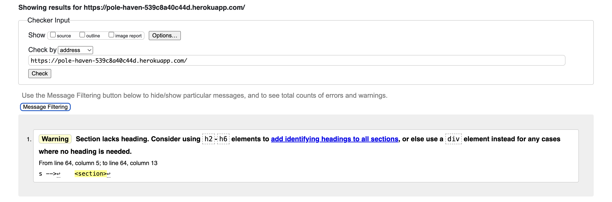

### About Page
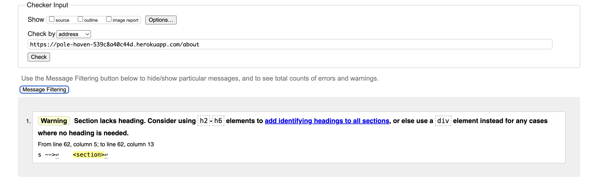

### Contact Page
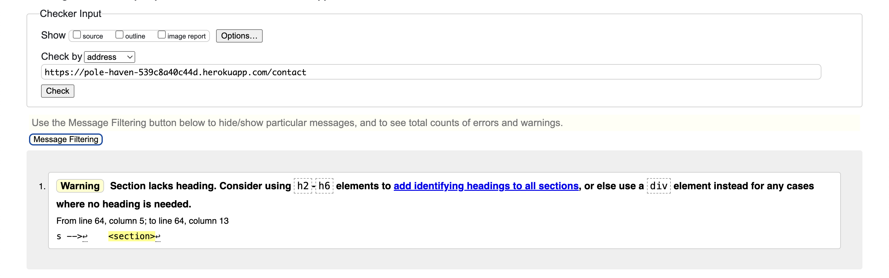

### Blog Page
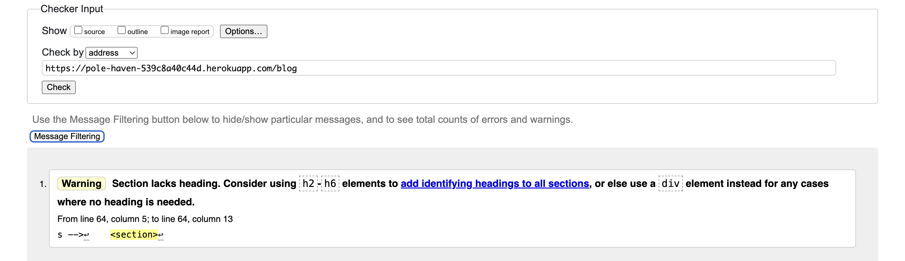

### Store Detail Page

### Order Summary Page

  
CSS Validator

  All styling pages were ran through a CSS Validator to ensure all code was optimised and no errors or bugs could take place.

  All Pages passed the CSS Validator with no erros

### about.css
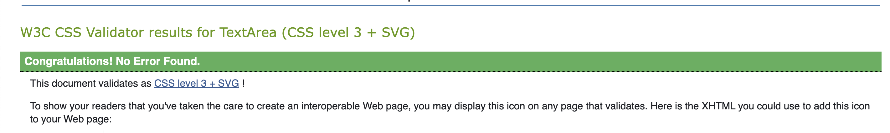

### blog-styles.css
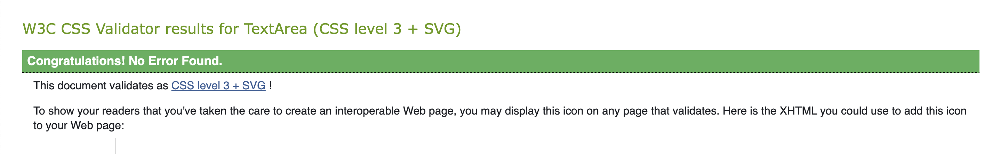

### contact.css

### forms.css
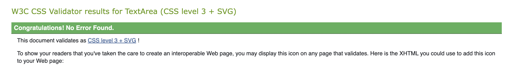

### online-store.css
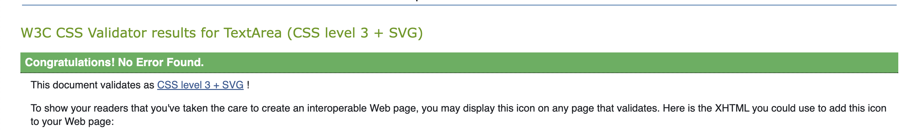

### styles.css
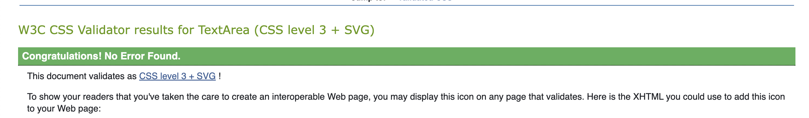

JSHINT

Overall both javascript files were tested and came back clear. Both files had no errors displayed

Messages.js
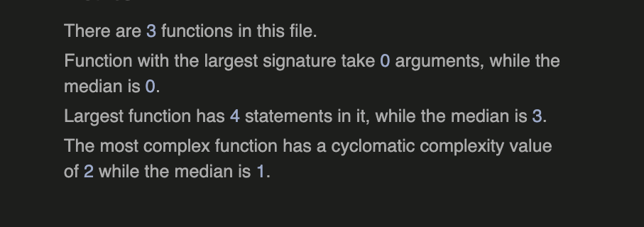

comments.js 
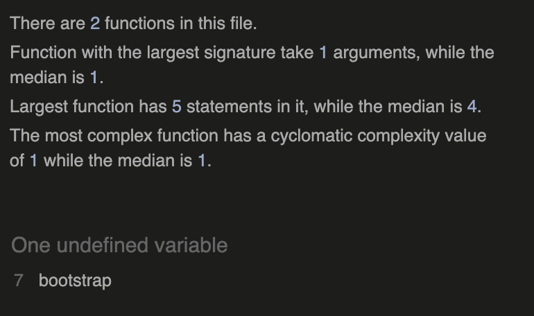

PYLINT

| App   | File             | Result           |
|-------|------------------|------------------|
| Pole_Store | settings.py       |   4 * Lines too long   |
|  | urls.py       | 4 * Lines too long        |
| about | urls.py       | Pass       |
| | views.py | Pass       |
| blog | views.py | 4 * Lines too long      |
| | urls.py | 2 * Lines too long      |
| | models.py | Pass     |
| | forms.py | Pass     |
| store | urls.py | Pass     |
| | forms.py | Pass     |
| | views.py | Pass     |

Overall the only error encountered throughout the pylint was 'Lines too long'. This could not be changed due to indentation affecting the code or comments of explination for the code.

Overall the rest of the code was clear and had no other errors

## Lighthouse Score

All Pages were tested with a lighhouse score Desktop and Mobile. This is to ensure the most effecient loading time, SEO, and Accessibiltiy. Here are the scores below

### Home Page
#### Desktop

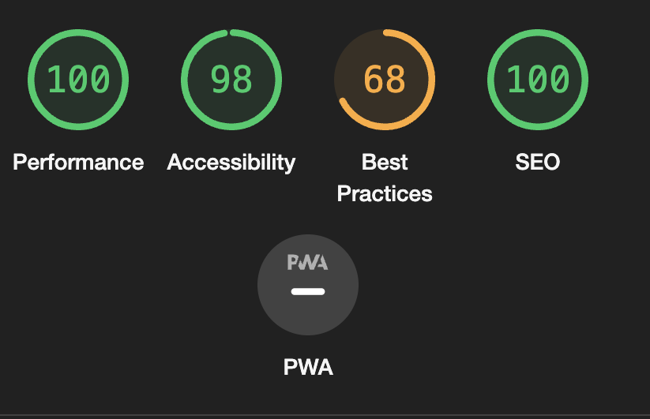

#### Mobile 
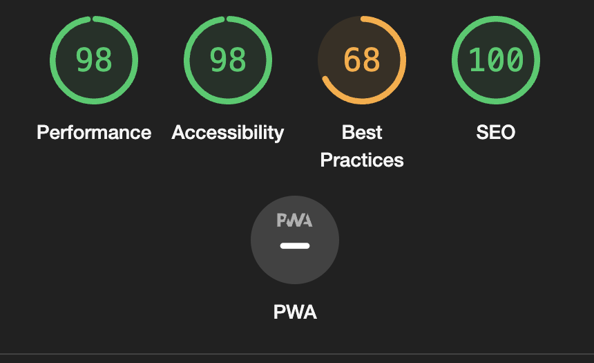

### About Page

#### Desktop
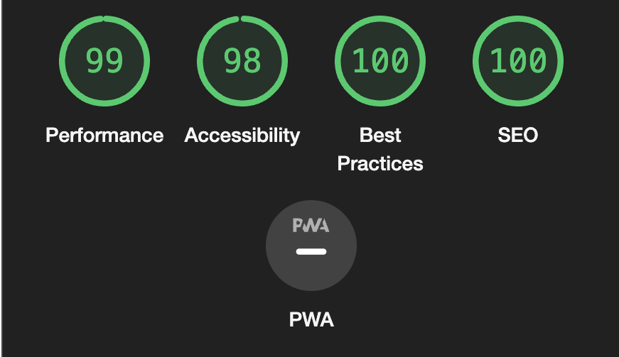

#### Mobile
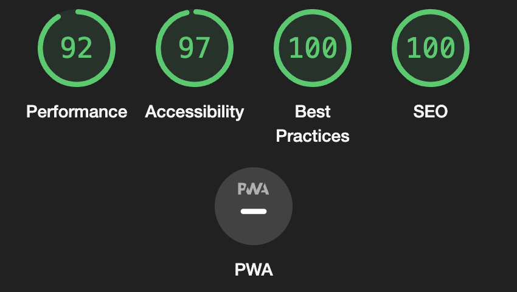

### Contact Page

#### Desktop

#### Mobile
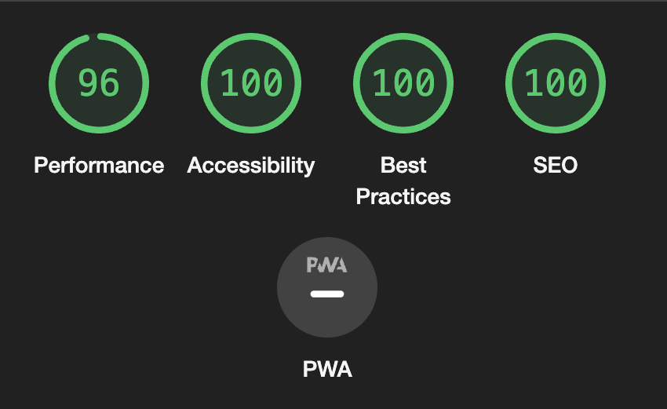

### Store Page

#### Desktop
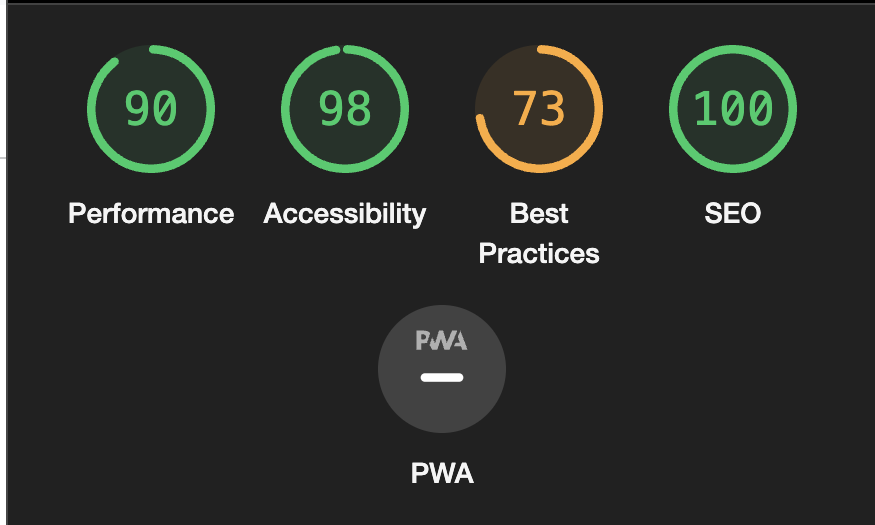

#### Mobile
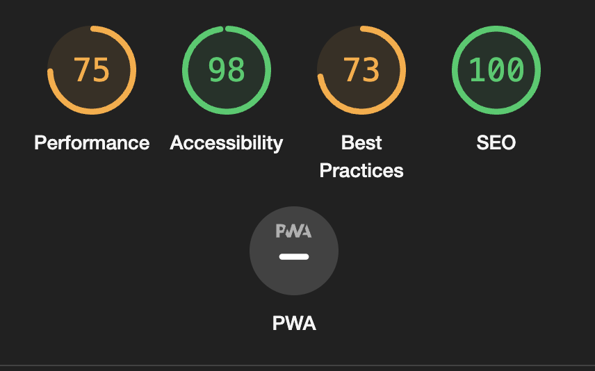

### Product Page

#### Desktop
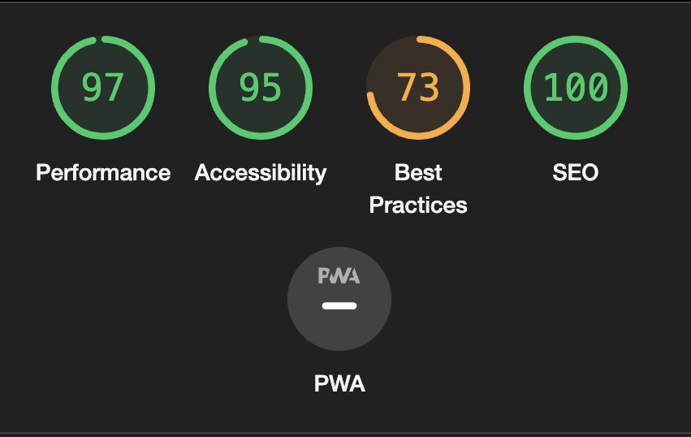

#### Mobile
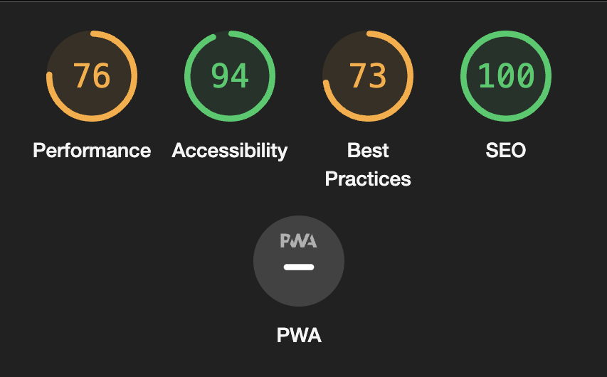

### Blog Page

#### Desktop
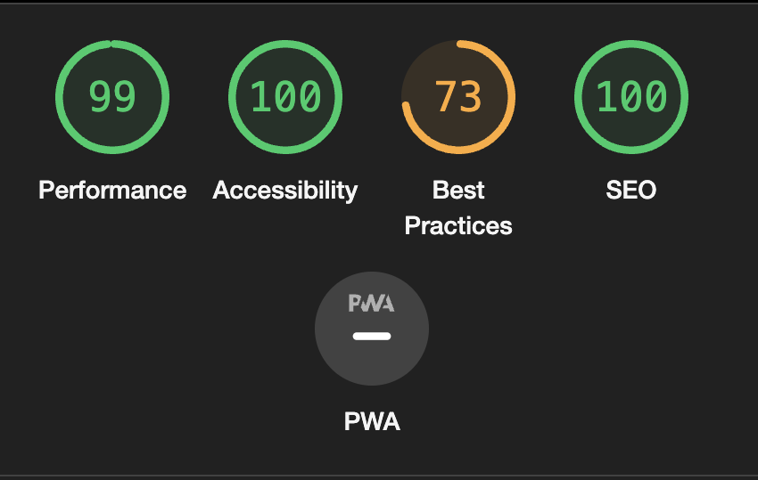

#### Mobile
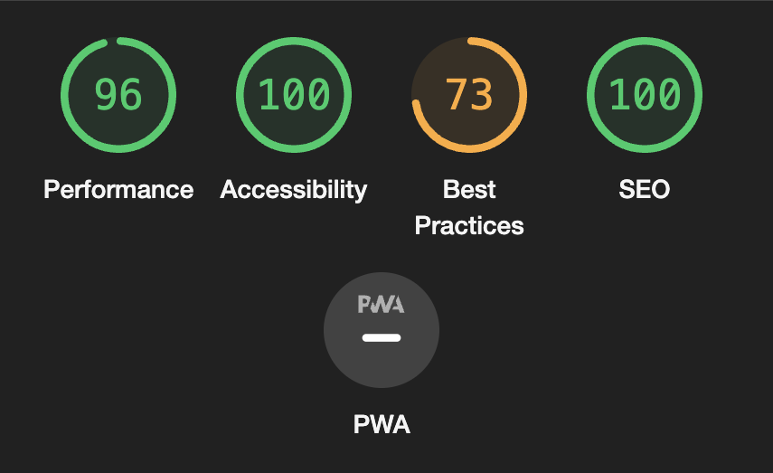

### Blog Detail Page

#### Desktop
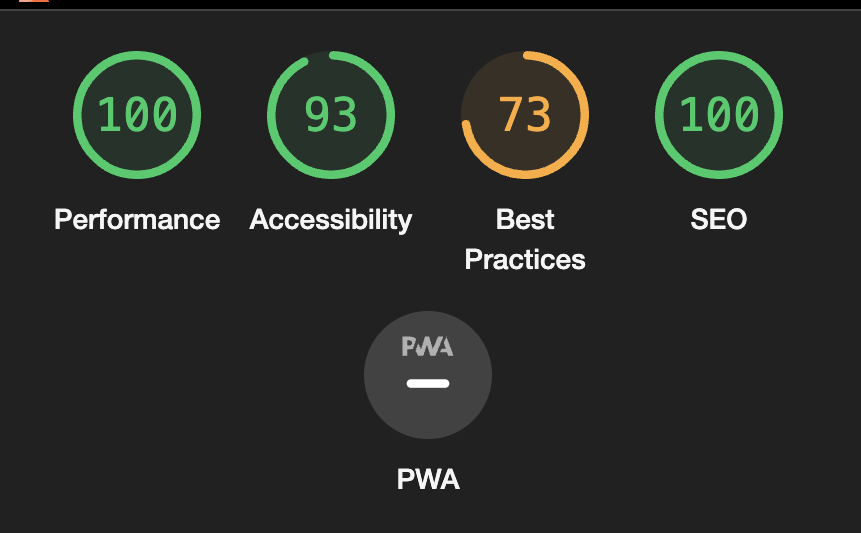

#### Mobile
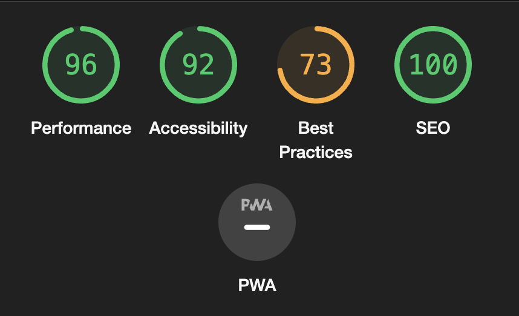

### Order Summary

#### Desktop
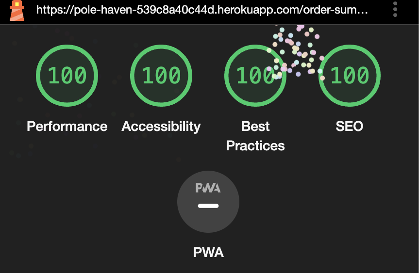

#### Mobile
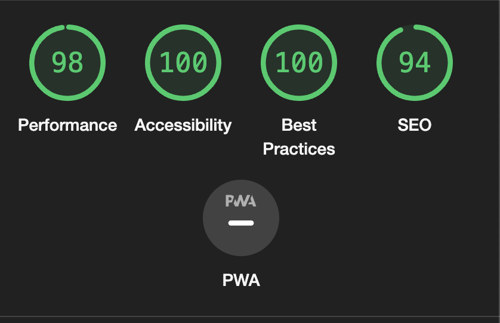

Overall the lighthouse scores were high and to the best of the abaility to ensure best peformance and accesibility for users. Then only error that I had encountered but couldnt rectify was cloudinary images being displayed an insecure http requests.

After research I could not find a suitable or correct method to remove this error to improve the best practice score.